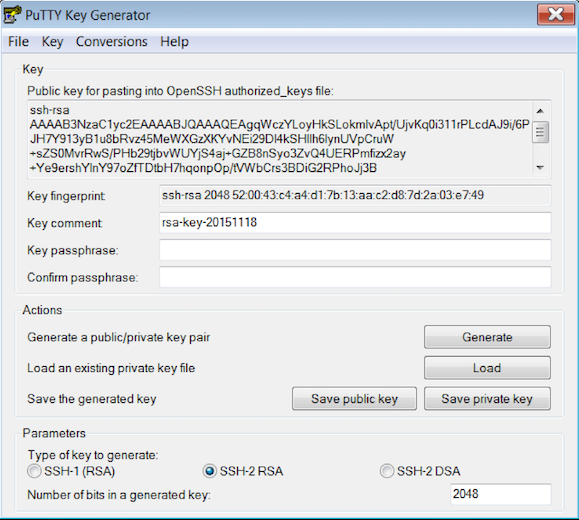

# Oracle Database Cloud Features Workshop

## Workshop Overview

This Getting Started guide will help you understand some of the most popular features of the Oracle Database Cloud Service.  You will be required to download several software tools to access the Oracle Database Cloud Service.  This workshop and the labs that follow support either Windows clients or Linux clients.

## Workshop Requirements

* Access to Oracle Cloud Infrastructure
    * Provided by the instructor for instructor-led workshops
* Access to a laptop or a desktop
    * Requires Microsoft Remote Desktop software
* Putty or OpenSSH and web browser
* SSH Keys

## SSH Keys

Keys are part of the key pairs used to securely connect to the Oracle Database Cloud.  By default Oracle Cloud uses the secure key infrastructure for connectivity from a client.
- id_rsa – private key on Linux client
- id_rsa.ppk – private key for Putty client
- id_rsa.pub – public key installed on the Oracle Cloud server

If you are using a Linux client, immediately change the file permissions on **id_rsa** using the change mode command.

````
$ chmod 600 id_rsa
$ ls –al id_rsa
-rw-------  1 oracle oracle     1671 Jan 20 20:40 id_rsa
````

>**Note** : The instructor may provide you a pre-created set of keys.

### Generate your own Public and Private Keys

This section shows you how to create your own public and private key.  Once created, the public key is placed on the cloud server, and the private key is distributed to the clients to unlock the public key during the client connection to the server.

#### Key Generation From a Windows Client

1. Create a Public Key and a Private Key using Puttygen.exe


2. Click Generate and move the mouse around the blank area to generate randomness.


3. Select all and copy the generated Public Key.  You may need to scroll down to copy the entire key.  Open a text editor and paste the entire key and save the file as mykey.pub.  You will upload this public key to the Cloud Service later.

>**Note** : The Save public key does not save the public key in the right format, you must copy and paste the generated public key.

4. Click Save Private Key to your laptop with a name of mykey.ppk and in a directory of your choosing. You can optionally create a key passphrase.  The passphrase is used for extra security whereby when you connect, it will prompt for the passphrase.  You can use SSH-2 RSA as the type of key to generate.



#### Key Generation From a Linux Client

1. Open a new terminal window.

2. Type ssh-keygen –t rsa

3. You can hit enter for the default or enter a new file name when prompted with:

````
Enter file in which to save the key (/home/demo/.ssh/id_rsa): 
````

4. You can also enter in a passphrase for additional security to unlock the private key.  Hit return here, we will not have a passphrase.

````
Enter a passphrase (empty for no passphrase):
````

5. For example, you should see the following:

````
ssh-keygen -t rsa
Generating public/private rsa key pair.
Enter file in which to save the key (/home/demo/.ssh/id_rsa): /home/demo/.ssh/mykey
Enter passphrase (empty for no passphrase): 
Enter same passphrase again: 
Your identification has been saved in /home/demo/.ssh/mykey.
Your public key has been saved in /home/demo/.ssh/mykey.pub.
The key fingerprint is:
````

Now you are ready to upload the public key to the Oracle Database Cloud Server when creating the instance.

## Agenda

- **Lab 1 : Memoptimized Rowstore Fast Ingest**
- **Lab 2 : Resource Manager and SQL Quarantine**
- **Lab 3 : Oracle 19c Automatic Indexing**
- **Lab 4 : Managing Hybrid Partitioned Tables**
- **Lab 5 : Oracle 20c Preview Blockchain Tables**

## Access the Labs

- Use **Ξ Lab Contents** menu on your right to access the labs.
    - If the menu is not displayed, click the menu button  on the top right  make it visible.

- From the menu, click on the lab that you like to proceed with. For example, if you like to proceed to **Lab 1**, click **Lab 1 : Oracle Cloud Infrastructure (OCI)**.

- You may close the menu by clicking 

## Acknowledgements

- **Author** - Valentin Leonard Tabacaru
- **Last Updated By/Date** - Valentin Leonard Tabacaru, Principal Product Manager, DB Product Management, May 2020

See an issue? Please open up a request [here](https://github.com/oracle/learning-library/issues). Please include the workshop name and lab in your request.


